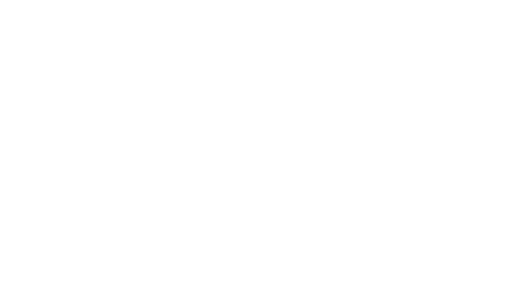
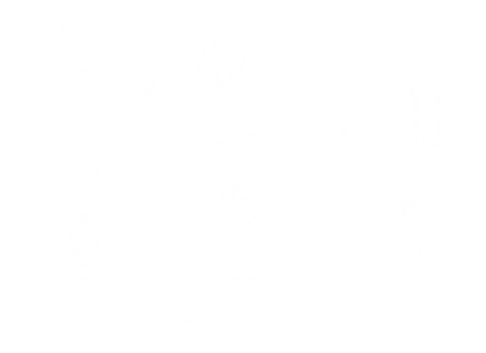

class: middle right

# Alternative Controllers

 [Enric Llagostera](http://enric.llagostera.com.br)

Workshop for CART 360 Fall 2019 on October 18

---
class: middle

**hi!**

.hi[Enric Llagostera.] he/him. brazilian. phd student at concordia. research interests: political game design, alternative controllers, game making tools, game circulation. <http://enric.llagostera.com.br>

---
class: middle center

## so, alt ctrls...

---
class: middle center

## WHAT? + WHY? + HOW?

---
class: middle center

# WHAT?

---
class: invert middle center

.box[Controllers...]

.no_border[]

---
class: top
background-image: url(images/swink.png)

.box[Classic model of interaction (Swink, 2008)]

---
class: middle center

## a status quo made of <br/> .hi[hands, ears & eyes]

---
class: middle center

## expressiveness = <br/> verbs + physical layer

---
class: top right
background-image: url(images/diagram-for-slides.png)

---
class: middle center

## expressiveness = <br/> (embodied) actions + things

---

class: invert middle center

.no_border[]

.box[Controllers!!!]

---
class: middle center

# WHY?

---
class: middle

### A short list

1. Things as invitations for playfulness.
2. We can learn to play all over again.
3. Unexpected materiality as a basis for performance.
4. We are embodied players with different bodies and bodily cultures.

---
class: middle

### My reasons

- The need to problematize **innovative game design** discourses.
- Brecht & alienation effects: point to **systemic forces**.
- Algava, Boal & forum theatre: **play & situated dialogue**.
- Relationship with craft, industry and DIY culture: **circulation & practices**.
- Invitations, **encounters**, transitions (in-out).

---
class: middle

## Alternative controllers help to re-situate and transform play, pointing to different systemic issues and practices.

---
class: top
background-image: url(images/use.jpg)

.box[cook your way : cooking station]

---
class: bottom invert right
background-image: url(images/stirring_demo_site.gif)

.box[cook your way : play example]

---
class: middle

## Cook Your Way

- Speculative controller as **embodiment** of a (not-that-)fictional gameworld.
- **Critique** of capitalist discourses of multiculturalism and oppressive immigration systems.
- **Contradictions** as invitations to reflection: visuals and text.
- **Modding** and circulation.

---
class: middle center

# HOW?

---
class: middle

### Some approaches

1. Re-appropriated device + extension + HID + existing game (gambi_abo)
2. Custom device + serial + custom game (Cook Your Way)
3. Custom device + HID + existing game (what we'll be making)

---
class: top right
background-image: url(images/diagram-for-slides.png)

---
class: middle

### Some approaches

1. .hi[Re-appropriated device + extension + HID + existing game (gambi_abo)]
2. Custom device + serial + custom game (Cook Your Way)
3. Custom device + HID + existing game (what we'll be making)

---
class: top invert
background-image: url(images/gambicon02.gif)

.box[gambi_abo : mining sieve controller]

---
class: top right

background-image: url(images/gambi-mouse.jpg)

.box[gambi_abo : mining sieve base]

---
class: middle

### Design moves in .hi[gambi_abo]

- Identify inputs recognized by the game;
- Analyze the possible inputs from the device at hand;
- Imagine verbs for the different inputs (in-game and in-device);
- Extend scales of movement;

---
class: middle

### Some approaches

1. Re-appropriated device + extension + HID + existing game (gambi_abo)
2. .hi[Custom device + serial + custom game (Cook Your Way)]
3. Custom device + HID + existing game (what we'll be making)

---
class: top right invert
background-image: url(images/stirring.gif)

.box[cook your way : pot stirring prototype]

---
class: top right invert
background-image: url(images/prototype.gif)

.box[cook your way : actions prototype]

---
class: top right invert
background-image: url(images/ingredient.jpg)

.box[cook your way : ingredient prototype]

---
class: middle

### Design moves in .hi[Cook Yor Way]

- Imagine actions and performance;
- Experiment with different materials;
- Map the state of information in the system;

---
class: middle

### Some approaches

1. Re-appropriated device + extension + HID + existing game (gambi_abo)
2. Custom device + serial + custom game (Cook Your Way)
3. .hi[Custom device + HID + existing game (what we'll be making)]

---
class: top right
background-image: url(images/diagram-for-slides.png

???

- highlight what are we foregrounding

---

class: top right
background-image: url(images/diagram-for-slides-2.png)

???

- updated diagram for rest of workshop

---
class:middle

# Clappy Bird

<https://flappybird.io/>

---
class: top right
background-image: url(images/reverse.png)

---
class:middle

### Clappy Bird

<https://flappybird.io/>

**Situation:** Flap wings (_in-game effect, instantaneous_) -> Sensed as space key press or mouse down (_game application expects a mouse or keyboard via HID_) -> Finger movement to activate a button (_world change_).

---
class: top right
background-image: url(images/unreverse.png)

---
class:middle

### Clappy Bird

<https://flappybird.io/>

**Situation:** Flap wings (_in-game effect, instantaneous_) -> Sensed as space key press or mouse down (_game application expects a mouse or keyboard via HID_) -> Finger movement to activate a button (_world change_).

**Changes:** Clap hands / make noise (_world change, instantaneous_) -> Sensed as loudness change (_sensor state goes over a defined threshold on data_) -> Sent to _game application_ as space key press (_over a simulated HID keyboard_).

---
class: top right invert
background-image: url(images/itsybitsy.jpg)

.box[ItsyBitsy 32u4 board : simulates HID device]

---
class:middle

### Using the ItsyBitsy with the Arduino IDE

Board website: <https://www.adafruit.com/product/3677>

Setup on Arduino IDE: <https://learn.adafruit.com/introducting-itsy-bitsy-32u4/arduino-ide-setup>

[Manual (pdf) for download.](resources/itsy-bitsy-32u4.pdf)

---
class: bottom right invert
background-image: url(images/clappy_wiring.jpg)

.box[wiring the sound sensor]

---
class:middle

### Simulating a [keyboard](https://www.arduino.cc/reference/en/language/functions/usb/keyboard/)

```c
#include <Keyboard.h> // library to simulate keyboard events

int sensorPin = A0 ;  // define sensor port (analog A0)
int value = 0;    //set value to 0
int threshold = 320; // threshold for data range

void setup()
{
  Keyboard.begin();
}

void loop()
{
  value = analogRead(sensorPin);
  if(value > threshold){
    Keyboard.press(' ');
  }
  else {
    Keyboard.releaseAll();
  }
  delay(10);  //delay 0.01S
}
```

---
class:middle

## A [selection of games](https://itch.io/c/632428/altctrlworkshop-clab) to modify

---
class:middle

## So many sensors!

[Examples of code using the different sensors in the kit.](https://wiki.keyestudio.com/index.php/Ks0068_keyestudio_37_in_1_Sensor_Kit_for_Arduino_Starters)

---
class: middle

## Modding [Veloce](https://torfi.itch.io/veloce)

- How are in-game effects codified by the game application?
- What data ranges are expected?
- What sensors could work for this?
- What world changes could be interesting for these in-game effects?

---
class:middle

### Simulating a [mouse](https://www.arduino.cc/reference/en/language/functions/usb/mouse/)

- Using an [accelerometer](https://learn.sparkfun.com/tutorials/adxl337-and-adxl377-accelerometer-hookup-guide/example-code) for X and Y movement;
- [Example code for the ADXL337 accelerometer](https://github.com/sparkfun/ADXL337_Breakout/blob/master/firmware/ADXL337_example/ADXL337_example.ino);

---
class: top left invert
background-image: url(images/accelerometer.jpg)

.box[wiring the accelerometer]

---
Simulating a mouse with an accelerometer (1/2)

```c
#include <Mouse.h>
int scale = 3;
float mouseSpeed = 20.0;

void setup()
{
  Mouse.begin();
}

void loop()
{
  // Get raw accelerometer data for each axis
  int rawX = analogRead(A0);
  int rawY = analogRead(A1);
  int rawZ = analogRead(A2);
  
  float scaledX, scaledY, scaledZ; // Scaled values for each axis
  scaledX = mapf(rawX, 0, 675, -scale, scale); // 3.3/5 * 1023 =~ 675
  scaledY = mapf(rawY, 0, 675, -scale, scale);
  scaledZ = mapf(rawZ, 0, 675, -scale, scale);
  
  delay(10);

  Mouse.move(scaledZ * mouseSpeed, -scaledY * mouseSpeed, 0);
}
```

---
Simulating a mouse with an accelerometer (2/2)

```c
// Same functionality as Arduino's standard map function, except using floats
float mapf(float x, float in_min, float in_max, float out_min, float out_max)
{
  return (x - in_min) * (out_max - out_min) / (in_max - in_min) + out_min;
}
```

---

### References

Marcotte, J. (2018). Queering Control(lers) Through Reflective Game Design Practices. Game Studies, 18(3). Retrieved from http://gamestudies.org/1803/articles/marcotte.

Nova, Nicolas, and Laurent Bolli. Joypads!: The Design of Game Controllers. 1 edition. CreateSpace Independent Publishing Platform, 2014.

Swink, Steve. Game Feel: A Game Designer’s Guide to Virtual Sensation. 1 edition. Amsterdam ; Boston: CRC Press, 2008.

Tons of interesting alt ctrl projects: <http://shakethatbutton.com>
